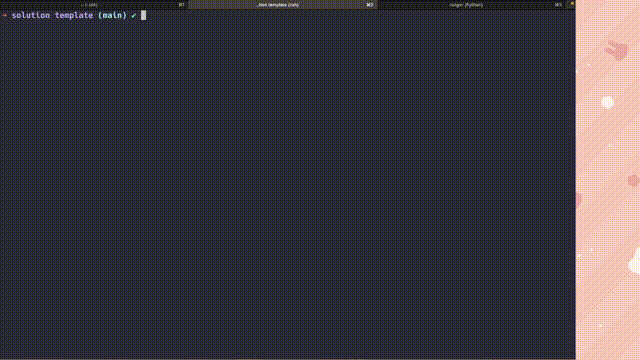
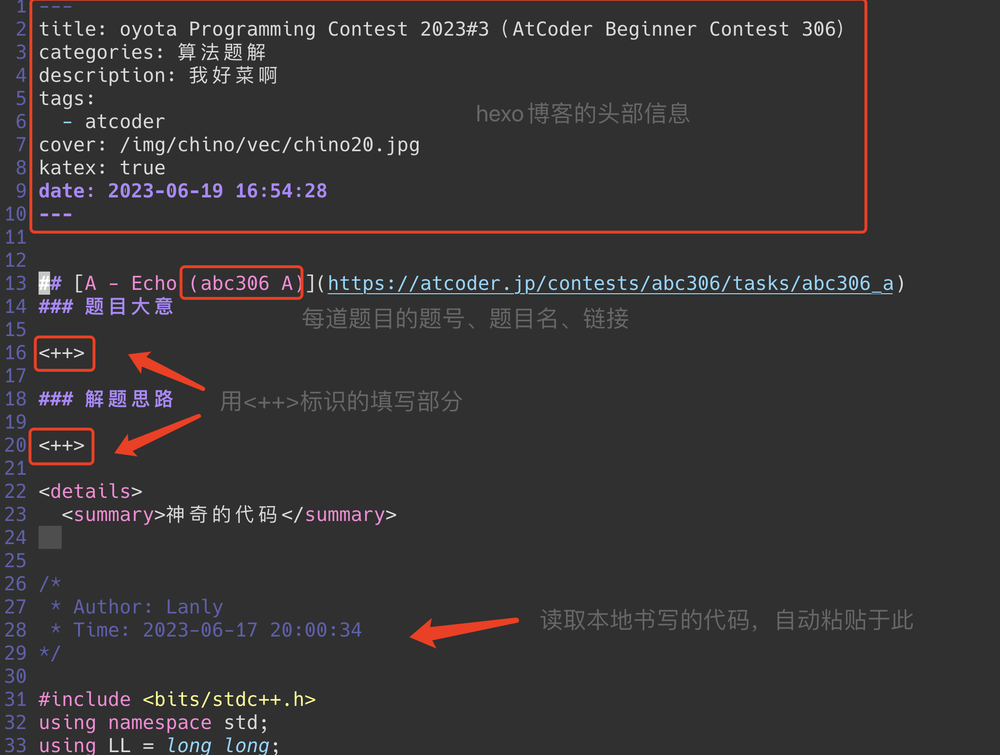
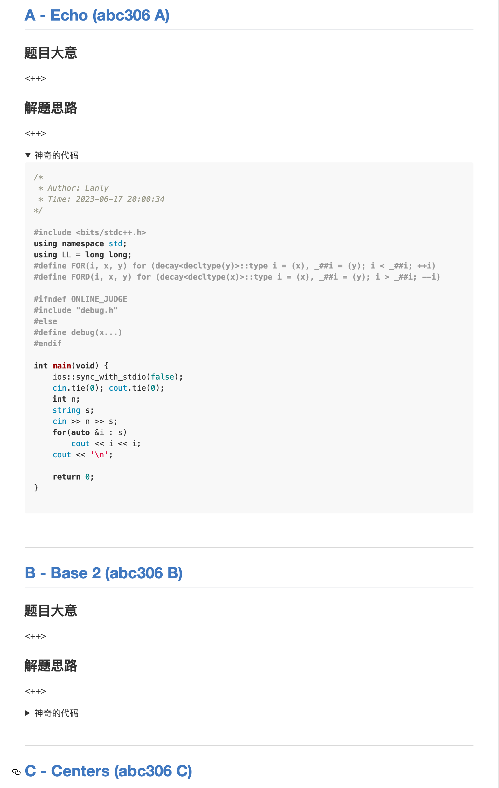

# Solution Markdown Template For Algorithm Contest

[](LICENSE)


一键生成带有丰富文本的题解的Markdown文件，让你爱上写题解！

## 功能介绍



一个好的题解，应该不仅包含题目的做法，还应该包含题目链接、题号检索、题目大意、AC代码，这样不仅方便别人阅读，更方便自己以后重温题目、归档代码。

但是复制粘贴题目链接、题号、AC代码非常繁琐，特别是一场有13道题的区域赛，其复制粘贴往往非常繁琐，容易消磨写题解的精力，因此本脚本可以帮助你省去这些繁琐的操作，让你专注于`题目大意`和`解题思路`的记录！

输入比赛的`url`（支持[atcoder](https://atcoder.jp),[codeforces](https://codeforces.com),[nowcoder](https://ac.nowcoder.com)），该脚本可以一键生成关于该比赛的所有题目的题解模板，包含题目名字、题目链接、自己编写的代码。

需要自己填写的用`<++>`标识。这样可以更专注于`题目大意`和`解题思路`的编写，省去了其余的繁琐操作。




生成文件预览（预览样式与采用的渲染引擎有关）



如果使用`vim`编写，可以在`.vimrc`里添加以下代码

```bash
" Press space twice to jump to the next '<++>' and edit it
noremap <SPACE><SPACE> <Esc>/<++><CR>:nohlsearch<CR>c4l
``` 

连续敲两次空格后，光标会自动查找并替换下一个`<++>`，这样可以无间断的书写`题目大意`和`解题思路`部分。

## 安装

```bash
git clone https://github.com/Lanly109/Solution-Markdown-Template-For-Algorithm-Contest.git
cd Solution-Markdown-Template-For-Algorithm-Contest
pip3 install -r requirements.txt
```

## 使用

修改`parser/atcoder.py,codeforces.py,nowcoder.py`的`code_path`函数返回值为自己代码的根目录。

代码存放结构参考[cf-tool](https://github.com/xalanq/cf-tool)

对于`atcoder.py`，其代码存放格式为
```bash
.
├── abc171
│   ├── a
│   │   └── a.cpp
│   └── f
│       └── f.cpp
├── abc172
│   ├── e
│   │   └── e.cpp
│   └── f
│       └── f.cpp
└── arc155
    └── a
        └── a.cpp
``` 

对于`codeforces.py`，其代码存放格式为

```bash
.
├── contest
│   ├── 1054
│   │   ├── a
│   │   │   └── a.cpp
│   │   ├── b
│   │   │   └── b.cpp
│   └── 1060
│       ├── b
│       │   └── b.cpp
│       ├── d
│       │   └── d.cpp
│       └── e
│           └── e.cpp
└── gym
    ├── 100405
    │   ├── a
    │   │   └── a.cpp
    │   ├── c
    │   │   └── c.cpp
    │   └── f
    │       └── f.cpp
    ├── 100851
    │   ├── a
    │   │   └── a.cpp
    │   └── l
    │       └── l.cpp
    └── 101173
        ├── a
        │   └── a.cpp
        ├── h
        │   └── h.cpp
        └── k
            └── k.cpp
```

对于`nowcoder.py`，其代码存放格式为

```bash
.
├── 33911
│   ├── a
│   │   └── a.cpp
│   ├── e
│   │   └── e.cpp
│   └── g
│       └── g.cpp
└── 48458
    ├── a
    │   └── a.cpp
    ├── c
    │   └── c.cpp
    └── d
        └── d.cpp

``` 

然后于终端运行

```bash
python3 ./main.py <url>
``` 

其中`url`可以是`atcoder,codeforces,nowcoder`之间的一个，比如

```bash
python3 ./main.py https://atcoder.jp/contests/abc306/tasks
python3 ./main.py https://codeforces.com/contest/1834
python3 ./main.py https://codeforces.com/gym/104010
python3 ./main.py https://ac.nowcoder.com/acm/contest/5157
``` 

当然，如果你不喜欢命令行输入`url`，可以修改`main.py`，在代码里写入`url`，然后直接运行。

```bash
python3 ./main.py
```

如有需要，可自行更改`./parser/base.py`里的`header`和`template`函数，适应自己的`hexo`博客或个性化博文样式。

## 更新日志

### 2023.06.19

- 重构代码，发布

